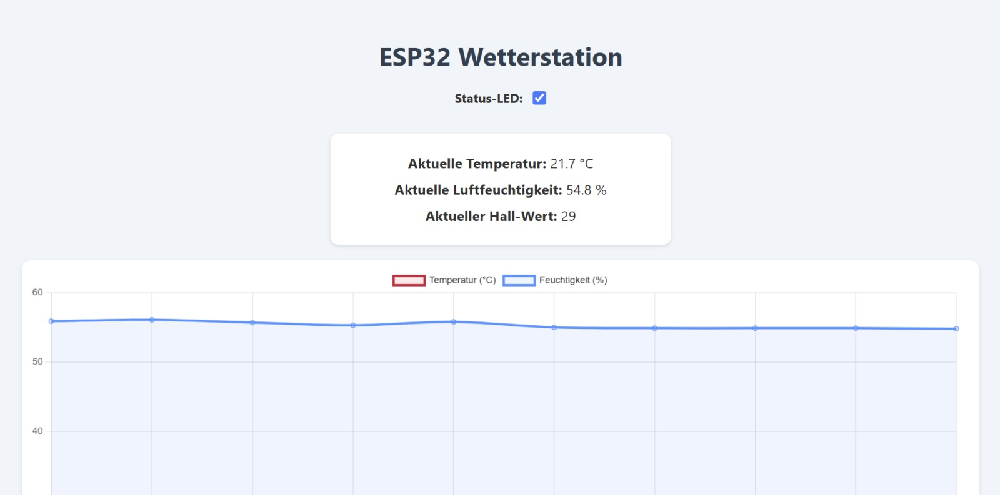
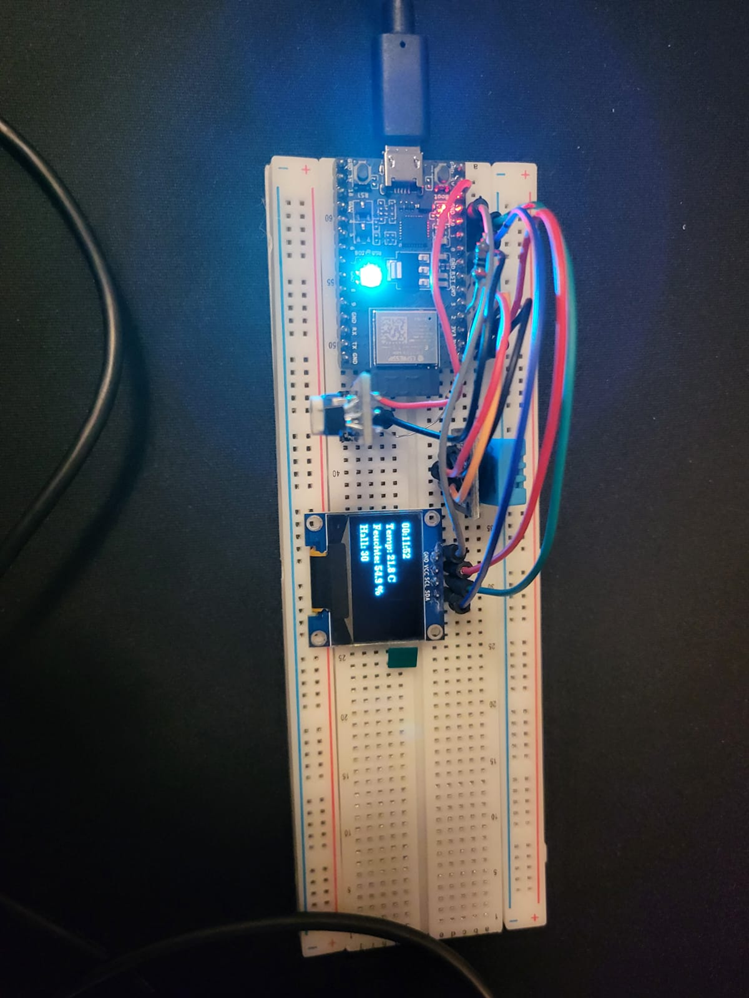

# Wetterstation SYT & ITP

**Datum:** 27. Mai 2025  
**Verfasser:** Maik Gao & Marcel Hofmann  

---

## Inhalt

1. [Einführung](#einführung)  
2. [Projektbeschreibung](#projektbeschreibung)  
3. [Theorie](#theorie)  
4. [Arbeitsschritte](#arbeitsschritte)  
5. [Zusammenfassung](#zusammenfassung)  
6. [Literaturverzeichnis](#literaturverzeichnis)  

---

## Einführung

Im Rahmen dieses Projekts wurde eine einfache Wetterstation auf Basis des ESP32 entwickelt. Ziel war es, Umweltdaten wie Temperatur, Luftfeuchtigkeit und Magnetfeldstärke zu erfassen und über ein Webinterface darzustellen. Zusätzlich wurde das Projekt um zahlreiche Funktionen erweitert, um praktische Anwendungsmöglichkeiten zu demonstrieren und die Arbeit mit Mikrocontrollern praxisnah zu vertiefen.

---

## Projektbeschreibung

Es wurde eine Wetterstation realisiert, die über Sensoren

- Temperatur & Luftfeuchtigkeit (DHT11)  
- Magnetfeldstärke (Hall-TTL-Sensor)

misst. Die Daten werden auf einem Webinterface angezeigt, ergänzt durch einen einfachen Graphen zur historischen Darstellung sowie durch ein lokalen OLED-Display. Weitere Features wie Sleep-Mode, Status-LED-Steuerung und ein Wi-Fi-Manager wurden implementiert.

### Webinterface

  
*Screenshot der responsiven Weboberfläche mit aktuellem Diagramm und Werten.*

### Hardwareaufbau

  
*Foto des Breadboard-Aufbaus mit DHT11, Hall-Sensor, OLED und NeoPixel.*

---

## Theorie

Für die Umsetzung dieses Projekts ist grundlegendes Wissen über

- Sensorik  
- Web-Server-Programmierung auf Mikrocontrollern  
- Energieeffiziente Datenverarbeitung  

erforderlich. Zum Einsatz kamen folgende Komponenten:

- **DHT11** – digitaler Sensor für Temperatur und Luftfeuchtigkeit  
- **Hall-Sensor (TTL-Ausgang)** – Erkennung magnetischer Felder  
- **ESP32-C3 DevKitM1** – Mikrocontroller mit integriertem WLAN und Sleep-Mode  
- **OLED-Display (SSD1306, 0,96″ 128×64)** – lokale Anzeige der Messwerte  
- **RGB-LED (NeoPixel)** – Statusanzeige für Verbindung, Messung, Grenzwertwarnung  
- **Chart.js** im Webinterface – Darstellung historischer Mittelwerte  

Die Visualisierung historischer Daten basiert auf der Aggregation von Intervallen (z. B. Durchschnittswerte alle 5 Minuten), um Speicherbedarf und Ladezeiten gering zu halten. Der Wi-Fi-Manager erlaubt eine flexible WLAN-Verbindung oder das Aufspannen eines Access-Points über das AsyncWebServer-Modul.

---

## Arbeitsschritte

1. **Komponenten prüfen & aufbauen**  
   - DHT11 an GPIO 2 (mit 10 kΩ Pull-Up)  
   - OLED-Display über Software-I²C (SDA=GPIO 1, SCL=GPIO 10)  
   - Hall-Sensor an GPIO 3 (analogRead für feine Werte)  
   - NeoPixel-LED an GPIO 8  

2. **Entwicklungsumgebung einrichten**  
   - Arduino IDE mit ESP32-C3-Boardpaket  
   - Installation benötigter Bibliotheken:  
     - DHT sensor library & Adafruit Unified Sensor  
     - U8g2 für OLED  
     - Adafruit NeoPixel  
     - ESPAsyncWebServer, AsyncTCP  
     - WiFiManager  

3. **Einzeltests**  
   - DHT11 → Temperatur/Luftfeuchte auf Serial Monitor  
   - OLED → Textausgabe mit U8g2  
   - NeoPixel → Farbwechsel  
   - Hall-Sensor → analoges Auslesen, Wertevergleich mit Magnet  

4. **Hauptcode entwickeln**  
   - **WLAN-Setup:** WiFiManager mit Access-Point-Fallback  
   - **Zeit:** NTP-Sync über `configTime()`  
   - **Sensor-Loop:**  
     - Mittelwerte aus 5 Messungen (je 100 ms Pause)  
     - Ausreißerfilterung  
   - **Display:**  
     - Uhrzeit, Temperatur, Luftfeuchte, Hall-Wert auf OLED  
   - **Webinterface:**  
     - HTML/CSS/JS in Raw-String  
     - AJAX-Polling alle 5 s → JSON-Endpoint `/data`  
     - Chart.js-Diagramm für historischen Verlauf  
     - LED-Toggle über GET `/led?state=on|off`  

5. **Integration & Tests**  
   - Zusammenführen aller Module in einem Sketch  
   - Langzeittest (> Stunden) auf Stabilität  
   - Überprüfung auf PC & Smartphone  

---

## Zusammenfassung

Es wurde eine voll funktionsfähige Wetterstation auf Basis eines ESP32-C3 Mikrocontrollers realisiert, die

- Temperatur, Luftfeuchtigkeit und Magnetfeldstärke erfasst  
- Messwerte lokal auf OLED darstellt  
- über Webinterface aktuelle und historische Daten ausliefert  
- eine per Web steuerbare Status-LED besitzt  

Alle Komponenten arbeiten zuverlässig zusammen. Die aggregierte Darstellung historischer Daten und der WiFiManager-Fallback erhöhen Benutzerfreundlichkeit und Robustheit. Die Dokumentation und der modulare Codeaufbau ermöglichen einfachen Nachbau und Erweiterung.

---

## Literaturverzeichnis

1. Arduino – **DHT11 | Arduino Tutorial**, Arduino Getting Started. Abgerufen 27. Mai 2025. https://arduinogetstarted.com/tutorials/arduino-dht11  
2. **Chart.js**, W3Schools. Abgerufen 27. Mai 2025. https://www.w3schools.com/js/js_graphics_chartjs.asp  
3. **ESP32 – OLED**, ESP32IO Tutorial. Abgerufen 27. Mai 2025. https://esp32io.com/tutorials/esp32-oled  
4. Santos, S. – **ESP32 with DHT11/DHT22 Temperature and Humidity Sensor**, Random Nerd Tutorials. Abgerufen 27. Mai 2025. https://randomnerdtutorials.com/esp32-dht11-dht22-temperature-humidity-sensor-arduino-ide/  
5. Tiago – **ESP32-C3 Super Mini Real-Time Clock with OLED Display**, EdgeMicroTech. Abgerufen 27. Mai 2025. https://www.edgemicrotech.com/esp32-c3-super-mini-real-time-clock-with-oled-display/  
6. **ESPAsyncWebServer**, GitHub. Abgerufen 27. Mai 2025. https://github.com/ESP32Async/ESPAsyncWebServer  
7. **WiFiManager**, GitHub. Abgerufen 27. Mai 2025. https://github.com/tzapu/WiFiManager  
8. **Random Nerd Tutorials – Wifimanager**, Abgerufen 27. März 2025. https://randomnerdtutorials.com/esp32-wi-fi-manager-asyncwebserver/  
